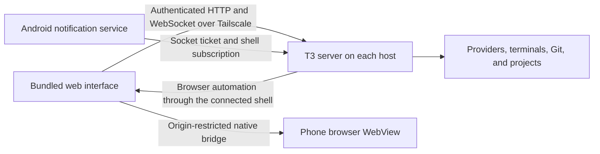

# Fork Android app: build and development

This fork ships its own Android app from `apps/android-pwa`, package `com.devotek.t3code.pwa`.
It bundles this fork's `apps/web` interface in a native Android WebView, with native notifications,
file handling, and a separate phone browser. It primarily connects to fork environments over
Tailscale using **Settings → Connections**. It has no baked-in primary host.

This APK is separate from the upstream Google Play app and the Expo/React Native client in
`apps/mobile`. Expo, Metro, EAS, Firebase, and the upstream app's notification setup are not part
of this build. The directory's `pwa` name reflects its reuse of the installed-PWA web layout;
it is a standalone APK with bundled assets, not a Chrome-installed PWA or a Trusted Web Activity.
Website verification and `assetlinks.json` are not required.

For everyday installation, pairing, and use, see the [fork Android guide](../user/android-fork.md).

## Build prerequisites

Build from the repository root on Linux, macOS, or WSL. The helper rejects native Windows;
when building in WSL, the build tools must be available inside that distro.

- Node.js 24.10 or newer and Vite+ (`vp`), with repository dependencies installed using `vp i`.
- JDK 17, selected through `JAVA_HOME`.
- Android SDK command-line tools, platform 36, SDK Build-Tools, and platform-tools (`adb`).
- A private signing keystore and password file kept outside the checkout.

For an SDK installed at the usual Linux location, configure your shell with:

```bash
export JAVA_HOME="/path/to/jdk-17"
export ANDROID_HOME="$HOME/Android/Sdk"
export PATH="$JAVA_HOME/bin:$ANDROID_HOME/cmdline-tools/latest/bin:$ANDROID_HOME/platform-tools:$PATH"
sdkmanager --licenses
sdkmanager "platform-tools" "platforms;android-36" "build-tools;35.0.0" "build-tools;36.0.0"
vp i
```

Use the SDK location appropriate to your machine. `ANDROID_SDK_ROOT` is also accepted by the
build helper. The checked-in Gradle wrapper downloads Gradle 8.13 and verifies its checksum;
you do not need a separately installed Gradle. The app currently compiles and targets SDK 36,
with Android 7.0 / API 24 as its minimum.

## Signing identity

For an existing installation, use its original keystore, alias, and password. Generating a new
key will not produce an in-place update for that installation.

For a new app distribution, create the key once:

```bash
umask 077
mkdir -p "$HOME/.local/state/t3-android-signing"
keytool -genkeypair \
  -keystore "$HOME/.local/state/t3-android-signing/t3-pwa.jks" \
  -alias t3-pwa -keyalg RSA -keysize 2048 -validity 10000
```

Save the keystore password in a private text file, for example
`$HOME/.local/state/t3-android-signing/password`, readable only by its owner. The build uses that
password for both the keystore and key. Retain the keystore, alias, and password securely for
future updates; never commit or distribute them with the APK.

## Build a signed APK

Choose an app version corresponding to the fork release you are building; the version below
is an example. Run:

```bash
node scripts/build-android-pwa.ts \
  --keystore "$HOME/.local/state/t3-android-signing/t3-pwa.jks" \
  --password-file "$HOME/.local/state/t3-android-signing/password" \
  --version-name 0.0.45-fork.local \
  --allow-dirty
```

The helper builds `apps/web` with `VITE_ANDROID_PWA=1` into the Android app's generated assets,
runs Gradle `assembleRelease` and `lintRelease`, verifies the APK with `apksigner` (exactly one
signer) and `aapt2` (package, version code, version name, not debuggable), and copies the result
to `release/android-pwa/t3-code-pwa.apk`. It leaves the ordinary web output separate. Additional
options are `--key-alias`, `--output-dir`, `--asset-name`, `--version-code`, and
`--expect-signer SHA256`, which fails the build unless the APK carries that certificate.

The helper stamps every APK with its full source commit. A tree with uncommitted or untracked
changes is refused, because the APK would not match its commit. `--allow-dirty` builds it anyway
for local use: the APK is stamped with an unknown source and no release metadata is written, so it
cannot be mistaken for a release build.

The default version code is the current minutes since the Unix epoch. Every update must have a
higher code than the installed APK; builds within the same minute need an explicit higher
`--version-code`. A manually assigned high code must also be exceeded on subsequent builds.
Changing only `--version-name` does not make an APK an update. A normal build defaults its primary
recovery to the next code. Additional recovery builds use separately reserved `--version-code R`
values greater than their paired `--normal-version-code`; never reuse an Android version code.

Keep `VITE_HTTP_URL` and `VITE_WS_URL` unset. The app chooses remote hosts through Connections;
embedding a localhost origin in its web bundle breaks use from the phone.

### Release builds: normal and recovery APKs

A release publishes two APKs that share one signing identity. Both are built with the same helper
and each is written to its own output directory with a `metadata.json` sidecar (format 1: package,
version name and code, full source commit, signer digest, updater protocol, APK digest, kind,
asset name, and size). The release workflow compares that sidecar with the APK itself before it
assembles the release JSON in `packages/contracts/src/forkRelease.ts`, so the sidecar is a claim
and never proof.

| Build    | Command shape                                                                                                                                                                                               | Code                                            | Source                                   |
| -------- | ----------------------------------------------------------------------------------------------------------------------------------------------------------------------------------------------------------- | ----------------------------------------------- | ---------------------------------------- |
| Normal   | `--kind normal --version-name V --version-code N --asset-name t3-code-android-V.apk --output-dir out/normal`                                                                                                | `N`                                             | This checkout at the release commit      |
| Recovery | `--kind recovery --version-name PREV --normal-version-code N [--version-code R] --source-dir ../t3code-prev --source-commit PREV_SHA --asset-name t3-code-android-recovery-V.apk --output-dir out/recovery` | `R`, or `N + 1` by default; `R` must exceed `N` | The predecessor's checkout, not this one |

A recovery APK exists because Android refuses to downgrade: a bad update can only be replaced by
a build with a **higher** code. The release reservation assigns a unique code to each recovery
source, and each code must exceed its paired normal code. A device caches and verifies the recovery
APK matching its exact installed source version and commit before it installs the normal one, which
is what makes an automatic update reversible without uninstalling. The recovery build carries its
own updater, so a device rolled back to it can still update later.

The predecessor checkout must be at `--source-commit`, clean, have its dependencies installed
(`vp i`), and itself contain the native updater (`NativeUpdateController.java` and a `build.gradle`
that accepts `pwaSourceCommit` and `pwaRecovery`). The helper checks all of this.

**The first updater-equipped build has no predecessor to recover to.** Requesting its recovery
build fails closed with manual baseline guidance rather than producing a pretend one:

1. Build the first updater-equipped build as a normal APK.
2. Install it yourself over the existing app, with the same key (`adb install -r`, never uninstall).
3. Do not publish it as an automatically eligible release.
4. The following release uses that baseline's commit as its recovery predecessor.

Devices still running a build from before the updater existed never update in place from the app;
they take the baseline manually once.

## Install and update

For USB installation, enable Android developer options and USB debugging, connect the phone,
and accept the computer's debugging authorization on the unlocked phone:

```bash
adb devices
# First finish phone browser commands, uploads, and dialogs; background T3 Code for two minutes.
adb install -r release/android-pwa/t3-code-pwa.apk
```

If several devices are connected, select one with `adb -s SERIAL install -r ...`.
Alternatively, transfer the signed APK to the phone and open it with Android's package installer.

Use the same package ID, signing certificate, and a higher version code to preserve the existing
installation. Do not uninstall or clear app storage as an update step: that removes saved
connections. `INSTALL_FAILED_UPDATE_INCOMPATIBLE` usually means the signing key or package
identity differs; `INSTALL_FAILED_VERSION_DOWNGRADE` means the version code is too low.

Once a device runs an updater-equipped build it updates itself from this repository's GitHub
releases; see [In-app updates and recovery](#in-app-updates-and-recovery). Web UI changes still
require a new APK because the assets are bundled. Host/server changes require rebuilding and
updating each affected environment separately. The APK build does not deploy a server, change
Tailscale configuration, or install itself on a phone.

## Edit the app

Choose the layer that owns the behavior:

| Change                                                                            | Where to work                                                                                                                                                                              | How to verify                                                                                                                    |
| --------------------------------------------------------------------------------- | ------------------------------------------------------------------------------------------------------------------------------------------------------------------------------------------ | -------------------------------------------------------------------------------------------------------------------------------- |
| Shared screens, layout, Connections, or composer                                  | `apps/web`; shared state and connection behavior in `packages/client-runtime`                                                                                                              | Focused web tests and web typecheck, then rebuild the APK                                                                        |
| Android-specific UI and bridge coordination                                       | `apps/web/src/android` and `apps/web/src/components/settings/AndroidNotificationSettings.tsx`                                                                                              | Android bridge tests, then a device check                                                                                        |
| Android lifecycle, permissions, keyboard, file picker, or downloads               | `apps/android-pwa/app/src/main/java/com/devotek/t3code/pwa/MainActivity.java` and `app/src/main/AndroidManifest.xml`                                                                       | Android lint and a device check                                                                                                  |
| Native alerts or browser behavior                                                 | Native classes beside `MainActivity`; the browser's page runtime is `app/src/main/assets/t3-browser-runtime.js`                                                                            | Focused Java/web tests and the native browser smoke runner                                                                       |
| In-app updates, install guard, or recovery                                        | `UpdateEngine.java`, `NativeUpdateController.java`, `RecoveryActivity.java`, `AppUpdateWorker.java`, and `apps/web/src/android/updates.ts`; release assembly in `scripts/fork-release*.ts` | Native unit tests, `updates.test.ts`, and a test-phone install (see [In-app updates and recovery](#in-app-updates-and-recovery)) |
| Remote execution, authentication, browser automation routing, or temporary shares | `apps/server`; wire schemas in `packages/contracts`                                                                                                                                        | Focused backend tests and scoped typechecks; update the affected hosts too                                                       |

Paths beginning with `app/` in the table are relative to `apps/android-pwa`.
Edits in `apps/mobile` change the upstream Expo client, not this APK.

Use `isAndroidPwa` for web behavior that belongs only to the Android package. Ordinary web,
installed browser PWA, desktop, and upstream mobile paths should retain their own behavior.
Rebuild with the helper after changing web or native sources; direct Gradle builds do not refresh
the bundled web assets. Keep the package constant in `scripts/lib/android-pwa-config.ts` and the
native package stable for updates.

Release builds disable WebView debugging. A debug build enables it through `BuildConfig.DEBUG`,
so use an isolated test installation and test credentials when debugging the shell. Debug and
release signing keys differ unless explicitly configured; a default debug APK cannot replace
your signed release while preserving its installation.

## Backend and native boundaries

The app does not run a T3 server on Android. Each connected computer runs this fork's server,
whether launched through its desktop app, CLI, or background service. That server owns projects,
Git, terminals, provider processes, provider credentials, and conversation history. The APK owns
its saved connection catalog, client preferences, phone browser state, and native permissions.



The trusted shell loads bundled files through Android's `WebViewAssetLoader` at
`https://appassets.androidplatform.net`. That is a local asset origin, not a backend hostname.
Connections uses the existing `packages/client-runtime` pairing, authorization, and RPC paths
against the chosen environment URL. Tailscale supplies connectivity; each environment still
requires pairing. Neither a VPN connection nor installing the APK grants access to every host.
Chrome's PWA has separate storage and does not share the APK's credentials.
Use Tailscale HTTPS for the primary setup; explicit HTTP endpoints on private networks are also
supported. The app does not create or control the Tailscale VPN itself.

Native bridges are restricted to the trusted shell origin. External links leave the shell, and
browser pages render in separate WebViews without those bridges. Microphone and camera access
requires Android permission. Attachments use Android's picker, and blob downloads use its Save
dialog with a 32 MB limit. Android backup and device transfer exclude app credentials.
The shell keeps its WebView through supported orientation, screen-size, fold, and keyboard
changes; the phone browser follows the visible slot's live dimensions.

### Host setup and development

Use a fork-built server binary when operating fork features. For a source build:

```bash
vp run --filter t3 build
node apps/server/dist/bin.mjs serve --tailscale-serve
```

Pair from the host's Connections settings or another terminal with
`node apps/server/dist/bin.mjs pair --tailscale`. See
[Tailscale HTTPS](../user/remote-access.md#tailscale-https) for alternate ports and route removal.
The environment's main Tailscale route is its connection endpoint; temporary browser shares have
a separate lifetime.

For development, use an isolated home directory and the supported sharing runner:

```bash
vp run dev --share --home-dir /tmp/t3-android-dev
```

Give the complete printed pairing URL to the test client. The dev runner removes its own share
on exit. Use an isolated test environment and stopped or synthetic threads; never start a test
server against the live `~/.t3/userdata`. See [development](./development.md) for state, ports,
and test data. When deploying a server update, use that host's existing installation or service
update procedure rather than starting a second server against its live state.

### Background alerts

Notification-service teardown stays on its background worker, including eviction of idle TLS
connections. Android calls service destruction on the main thread; closing a socket pool there can
raise `NetworkOnMainThreadException` during an update or when background alerts are stopped.

`AndroidNotificationCoordinator` copies enabled directly paired Bearer connections to the native
notification bridge. `NotificationCredentials` encrypts the native copy with an Android Keystore
AES-GCM key. Removing or disabling an environment, or disabling alerts, removes the corresponding
background registration without deleting the web client's saved connections.

`AgentNotificationService` uses those pairing credentials to request a fresh, single-use ticket
from `/api/auth/websocket-ticket`, connects to `/ws` using orchestration protocol 2, and subscribes
to `orchestration.subscribeShell`. It compares persisted thread state to generate Android alerts;
it does not start provider work. This path uses direct network connections, not FCM or Web Push.
Cloud DPoP authorization is not copied into this native transport.

The service uses Android's foreground-service notification to remain connected while the shell
is closed or the phone is locked. Tailscale and the host must remain reachable. Android power
saving can delay connections; force-stop prevents delivery until the app opens again, and the
app must be opened once after reboot. Historical completions are not replayed on first activation.
See the [notification setup](../user/android-fork.md#notifications) for the phone's settings.

### Phone browser and temporary shares

`AndroidBrowserHosts` registers the phone with the server's `PreviewAutomationBroker` using the
existing preview automation transport. `PreviewManager` tracks per-thread tab metadata; the
host forwards agent requests through the origin-restricted `t3Browser` bridge to `NativeBrowser`.
Pages execute on the phone, using its cookies, and `t3-browser-runtime.js` supplies page inspection
and supported actions. The app must be open for browser control, and the panel must be visible
for rendered screenshots. Eight native tabs are supported. Desktop profile import, recording,
and device emulation are not advertised by this host.

For an HTTP localhost or environment-port target, the phone requires the environment capability
`previewTemporarySharing`. `PreviewManager` uses `PortPublisher` to allocate a Tailscale HTTPS
share through a streaming loopback proxy, forwarding HTTP and WebSocket traffic to the dev server.
The last owning tab's closure or server shutdown tears it down. One hour without a browser page
visit also tears it down, checked every minute; hiding the panel does not. Port probes, assets,
background fetches, and WebSocket traffic do not renew that timer. Failed cleanup stays tracked
for retry; restart cleanup removes recorded mappings only when their proxy targets still match.
Manually configured Tailscale mappings are outside this lifecycle. Older hosts need updating
before phone localhost sharing can be used.

## In-app updates and recovery

The APK updates itself from `unn-corp/t3code` GitHub releases. The native updater is
[UpdateEngine.java](../../apps/android-pwa/app/src/main/java/com/devotek/t3code/pwa/UpdateEngine.java);
the shell reaches it through `NativeUpdateController` (the origin-restricted `t3Updates` bridge)
and the web adapter [updates.ts](../../apps/web/src/android/updates.ts). Android is a device of its
own: it never waits for a host, and a host never waits for it. Remote agents may keep running on
their hosts during an installation, because only this phone's own work matters here.

### What it does

- **Checks** at launch (at most every ten minutes) and about every six hours through WorkManager
  on an unmetered network. A manual check, or turning on a policy, may also use mobile data.
- **Selects** the highest installation code that is eligible for the channel. A nightly device
  accepts nightly and stable releases; a stable device accepts only stable. Existing installations
  default to nightly and fresh installs to stable (decided from Android's install history).
  Drafts are never considered, a release's recovery APK is never offered as a normal update, and a
  **withdrawn** release is skipped: withdrawal only rewrites the release notes, so native treats a line
  beginning `<!-- t3-fork-release:withdrawn` in the notes as ineligible (the same pattern as
  `scripts/fork-release-policy.ts`). Withdrawal is rechecked at install time and drops a staged build.
- **Verifies** before staging: the release JSON matches the contract exactly (any missing or
  mistyped field makes the release ineligible), the release flag and manifest channel agree, all
  four release checks passed, the package and signer match this installation, the normal build is
  the release commit, the recovery code outranks the normal code, and published asset sizes match.
- **Downloads** over HTTPS from GitHub's release hosts only (every redirect hop is checked), then
  checks the recorded SHA-256 and size, then reads the APK itself: package, a single signer equal
  to the installed app's signer, version code, and the source commit, source version, build kind,
  and updater protocol compiled into its manifest. The recovery APK is downloaded and verified
  first; a normal build is never staged without it. The two newest recovery builds are kept.
- **Installs** through `PackageInstaller` only when the guard admits it (below). Immediately
  before committing, it re-reads the release as it exists now and installs only if it is still
  eligible and byte-for-byte the release that was staged.

Digests detect corruption and substitution against the recorded release JSON. The trust boundary
is the GitHub HTTPS origin plus Android's platform signature rules (an update must be signed by
the installed certificate); a digest is never treated as authentication. There is no separately
signed index. In-app update needs Android 9 (API 28) or newer, which is when Android exposes
signing information for an APK that is not yet installed; older versions report it and update
manually. Android may still show its own confirmation: silent replacement only applies when this
app is the installer of record and the Android version allows it. The status reports which case
applies, and an unconfirmed install is surfaced by notification.

### Install guard and install requests

Every installation waits until **all** of these hold. The same guard admits an automatic update,
a person's **Install**, and a native **Recovery** request; nothing waives any row.

| Condition                                                                                            | Blocks as             |
| ---------------------------------------------------------------------------------------------------- | --------------------- |
| No T3 Code screen (shell or recovery) is open, and it has been out for 2 minutes                     | `idle-window`         |
| No phone browser command or unfinished page navigation is running                                    | `commands`            |
| No web upload or voice input pipeline is in flight (reported by the shell)                           | `uploads`             |
| No file picker, save, permission, or Android Settings screen is open                                 | `input-active`        |
| Global permission and the App updates channel allow installation confirmation                        | `authorization`       |
| Android lets this app install packages                                                               | `authorization`       |
| A verified recovery build is cached (or the request is a rollback to one)                            | `bootstrap`           |
| Recovered safety state has been reviewed after a verified reboot and no surviving installer sessions | `unknown-participant` |
| No installation is already pending                                                                   | `transaction`         |

Unknown foreground state (for example after the process was killed while the app was open) blocks
until the 2 minutes have been measured again.

**Requests.** `install` carries `{ action: "install", targetArtifactSha256 }`. Native checks that digest
against the staged, verified target and rejects a stale or missing one; it never installs a newer or
different build than the one reviewed. A valid request is persisted as an intent, the status becomes
`waiting` with the blockers (an ordinary active-phone blocker is a waiting state, never an error), and
the install is admitted later by a timer started when the app leaves the foreground, backed by a
WorkManager one-shot if the process is killed. Before admission everything is checked again: the
release is re-read (still published, not withdrawn, same manifest and digests), both APKs are
re-verified, and the guard is re-evaluated. Android's own confirmation may still open after admission.
A request does not change `automaticInstallation`, works with it off, and expires after 24 hours.
`cancel` (and the shared `cancel-countdown` control) withdraws it. A pin, a changed target, or a
withdrawn release cancels it. `recovery` carries `{ optionId, transactionId }`: `optionId` is the cached
recovery build's digest and `transactionId` was recorded with the option for the installed build, so
an option from before an update is rejected and no other cached build is ever substituted. `openRecovery`
only opens the native screen.

**Fail-closed holds.** Uploads and dialogs have no timeout. A heartbeat that stops proves nothing
about the transfer, so the shell's heartbeat only re-sends the count. An upload hold is released by
the shell reporting zero, by the shell page being replaced or destroyed (which cancels the transfer), or
by the process dying for process-owned uploads. External picker, save, permission, and Android Settings holds
are durable across process/activity teardown. Their matching result or a verified phone reboot
clears them; missing results keep installation blocked. Page navigation has a separate process-owned
hold until the main-frame load finishes, fails, or its tab closes, including when a command uses
`readiness: none`. Browser
commands keep a 5 minute lease only because native code bounds every command to 60 seconds. A leaked
hold therefore blocks installation rather than allowing one. `beginAndroidUpload()` in `updates.ts`
is awaited before the first upload network request, including minting a server upload ID, and remains
held through the byte transfer. Browser-recording uploads use the same admission. Native registers
the hold against the installation fence before acknowledging it; a lost or rejected reply prevents
the upload cycle from starting. Dictation holds acquisition, recording, decoding, and transcription
through the same pipeline; cancellation releases it after the pending acquisition/transfer settles.
The native file-save bridge takes its hold before decoding the supplied payload. The final quiet
check is repeated after writing the installer session, immediately before OS commit.

### State, pins, and restart verification

Updater state is one JSON file in app-private no-backup storage, written to a temp file, fsynced,
and renamed, with the previous file kept as a backup. It holds the policy (channel, automatic
installation), the pin, the running build's identity (source commit and version, kept apart from
the installation code), the pending installation, the staged download, cached recovery builds, and
health counters. Any unreadable primary file, even when its older backup is readable, turns
automatic installation off and blocks manual installation too. An older backup can omit a pending
installer or external-dialog hold. Review is accepted only after a proven phone reboot and no
surviving PackageInstaller sessions; changing an unrelated preference cannot waive that check. The format is shared with recovery builds, so fields may be added but never reinterpreted.

The pending installation and, for a rollback, the pin are persisted **before** `PackageInstaller`
is called; if that write fails, nothing is installed. The process is normally killed during the
install, so the next process proves what happened from the store: the running package must match
the intended code, source commit, version, and the SHA-256 of the installed APK. Anything else is
a failure and opens recovery. After 30 minutes an installation may be abandoned only after its
recorded OS session is verified terminated; elapsed time alone never releases the phone-work
fence. Failed artifact digests stay blocked until explicit retry or a different eligible target.
Cancelling a request defers automatic installation for a day.

A rollback pins the build it installs. **Resume** is the only thing that clears a pin, including a
pin whose install Android cancelled. A pinned device does not update. The pin records the held
build's digest, which is what the shared policy exposes as `pinnedBuild`.
After recovery, clearing the pin does not make the preceding normal APK installable: its code is
lower than the recovery APK. Commissioning that returns the phone to normal delivery therefore
needs a later eligible release whose normal code exceeds every published recovery code. Never
reuse the old normal APK or uninstall to work around Android’s monotonic installation code.

### Recovery

`RecoveryActivity` is a native screen with no WebView and no bridge. It opens **before** the shell
is created when the last installation failed identity verification or three consecutive launches
did not report healthy, from the launcher's **Recovery** shortcut, and from the failure
notification. It lists cached recovery builds Android would accept now, downloads the newest
published one, requests a chosen build (pinning it), shows install permission, and resumes updates.
A recovery request is the `recovery` intent above: it waits for two minutes outside the app and for
phone work to finish like any install, so leave the screen after requesting. It never uninstalls or
clears data, so pairings, drafts, and queues stay in place. **Continue to T3 Code** resets the launch counter and is available when no installation
is pending. While Android is replacing the app, phone work remains fenced.

A launch counts as healthy when the shell calls `markAndroidShellHealthy()` (mounted by the client
update interaction coordinator). Only an actual render signal counts, including pairing and onboarding screens. A page-load timer
cannot prove a functioning shell.

The staged update's paired recovery and the screen's rollback choices are different sets. The
updater selects a recovery artifact matching the installed build's exact source version and commit
from the release's recovery list (or the legacy primary recovery entry), and requires its Android
version code to exceed the target normal APK. This can be the same source commit as the currently
installed baseline while carrying a different source version and a higher installation code. The
selected digest is saved as `target.recoverySha256`; readiness must resolve it to its verified cache
record and file. Only after the forward build is installed can that predecessor be offered as a
rollback choice (its full source identity then differs from the running build).

Before downloading, the updater checks free bytes on both its app-private staging filesystem and the
installed package's filesystem. It budgets every uncached selected APK plus the later PackageInstaller
session and package expansion, then reserves headroom equal to the greater of 10% of that budget or
1 GiB. When both paths share a filesystem it checks the combined peak; otherwise it checks each
volume separately. It repeats the
install-space check after the two-minute quiet period and immediately before committing the OS
session. Unknown capacity blocks installation. A `storage` blocker leaves the selected target,
paired recovery APK, and manual install request intact; the updater never deletes a recovery APK to
make room.

### External recovery when the app cannot open

If neither the app nor its recovery screen works, install a signed recovery APK from outside.
External installers and ADB cannot enforce the native guard: finish browser automation, uploads,
and picker/permission dialogs, then leave T3 Code backgrounded for two minutes before replacing it:

1. Download the release's recovery asset (`t3-code-android-recovery-VERSION.apk`) and the release
   JSON. Check the asset's SHA-256 against the JSON.
2. Run `apksigner verify --print-certs` and confirm one signer with SHA-256
   `eb38a25cf25676b7418fee5105f66d9ff166bfd5546ba816288e5bd83b73d362`.
3. Install it over the current app with `adb install -r`, or open it with Android's package
   installer. Its code is higher than the broken normal build's. Never uninstall.
4. Open the recovered app and use **Resume** in the updater settings or the recovery screen once
   the cause is understood.

### Hooking new phone work into the guard

Anything that would be destroyed by replacing the app must register with `PhoneOperations`:
`begin(kind, id, PhoneOperations.UNTIL_ENDED)` when it starts and `end(kind, id)` when it finishes, on
every path including failure. Prefer `UNTIL_ENDED`: a hold that can expire by itself lets an install through
while the work may still be running. `NativeBrowser.handle` begins a `browser` operation for each `command` request
and `NativeBrowser.reply`, the single exit for every command result, ends it. `MainActivity` does
the same for the file chooser, save dialog, and media permission request, and
`NativeNotifications` for its permission dialog.

## Focused verification

After a full helper build has generated the web assets, run the relevant checks from the
repository root:

```bash
vp test run apps/web/src/android/browser.test.ts apps/web/src/android/browserRuntime.test.ts apps/web/src/android/notifications.test.ts apps/web/src/android/temporaryBrowserShare.test.ts apps/web/src/android/updates.test.ts
(cd scripts && vp test run --config ../vite.config.ts --dir . lib/android-pwa-config.test.ts)
vp test run apps/server/src/preview/PortPublisher.test.ts apps/server/src/preview/TemporaryShareProxy.test.ts apps/server/src/preview/Manager.test.ts
vp run --filter @t3tools/web typecheck
vp run --filter t3 typecheck
```

For native unit tests and lint:

```bash
cd apps/android-pwa
./gradlew --no-daemon :app:testReleaseUnitTest :app:lintRelease
```

The updater's decisions are covered by JVM tests: release JSON parsing, eligibility and channel
rules, the install guard and fail-closed operation holds, install requests and their digest binding, withdrawal, durable state and its failure modes, the
persist-before-installer ordering, restart reconciliation, recovery retention, APK and origin
checks. The `PackageInstaller` hand-off itself, the notification and confirmation flows, WorkManager
scheduling, and a real signed update need a device: install an updater-equipped build over
the previous one on a **test** phone with the same key, publish nothing, and confirm the
persist-before-install order, the post-restart identity check, the recovery screen, and that
saved connections survive. Do not exercise the updater on a phone that holds live pairings.

The custom `BrowserSmokeInstrumentation` in `app/src/androidTest` exercises the real release
WebView using a local fixture. Build its test APK with `:app:assembleReleaseAndroidTest` using
the same signing configuration as the app, then run it on an unlocked test device with an enabled
test environment. From `apps/android-pwa`, after installing the matching release APK:

```bash
export T3_PWA_KEYSTORE="$HOME/.local/state/t3-android-signing/t3-pwa.jks"
export T3_PWA_PASSWORD_FILE="$HOME/.local/state/t3-android-signing/password"
./gradlew --no-daemon :app:assembleReleaseAndroidTest
adb install -r app/build/outputs/apk/androidTest/release/app-release-androidTest.apk
adb shell am instrument -w -e environmentId TEST_ENVIRONMENT_ID \
  com.devotek.t3code.pwa.test/com.devotek.t3code.pwa.BrowserSmokeInstrumentation
```

Set `T3_PWA_KEY_ALIAS` too if you used an alias other than `t3-pwa`; replace `TEST_ENVIRONMENT_ID`
with your enabled test environment's ID. The test creates an unsaved synthetic tab, closes it afterwards, and does not run a provider turn. Its optional fold
mode uses device-specific state IDs; enable `testFold=true` only on a test device whose IDs match
the runner. Verify cover/inner resizing, keyboard, background notification delivery and tapping,
and saved-connection preservation in the actual client before shipping an update. Remove the
test package afterwards with `adb uninstall com.devotek.t3code.pwa.test`; retain the main app.

### Isolated native updater interaction check

`UpdaterSmokeInstrumentation` runs against a fresh, unpaired emulator using the actual release
WebView and native controller. Build the test APK with
`-PpwaTestRunner=com.devotek.t3code.pwa.UpdaterSmokeInstrumentation`; run
`adb -s emulator-5554 shell am instrument -w com.devotek.t3code.pwa.test/com.devotek.t3code.pwa.UpdaterSmokeInstrumentation`.
It checks actual shell health, waiting with uploads, stale-target rejection, cancellation, pin/resume,
pre-WebView recovery, local state preservation, Android Settings hold/return, and a slow native
page navigation hold, and installation blocking when the App updates notification channel is disabled. It refuses an existing updater identity and cannot run on paired production
state. The fork workflow builds its signed instrumentation APK from the pinned candidate source
as a separate CI artifact; this APK is never a release asset. PackageInstaller confirmation, process
death, reboot, and the real-device update/recovery flow remain commissioning checks.
